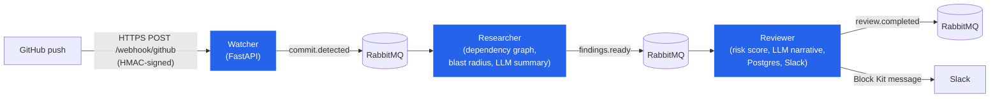
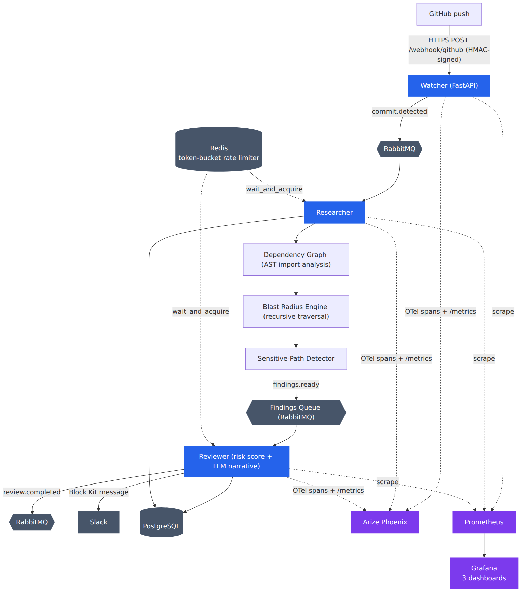
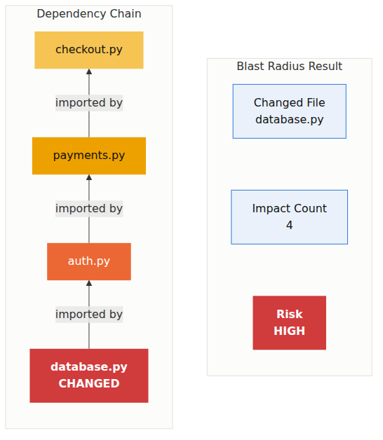
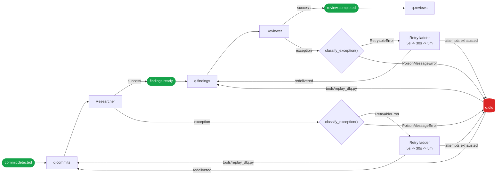
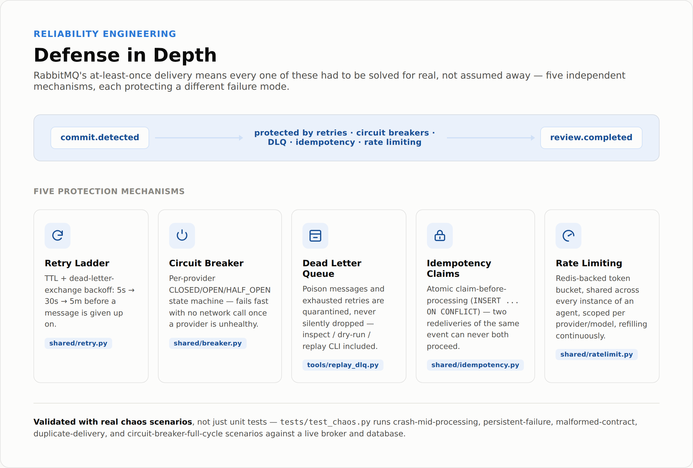
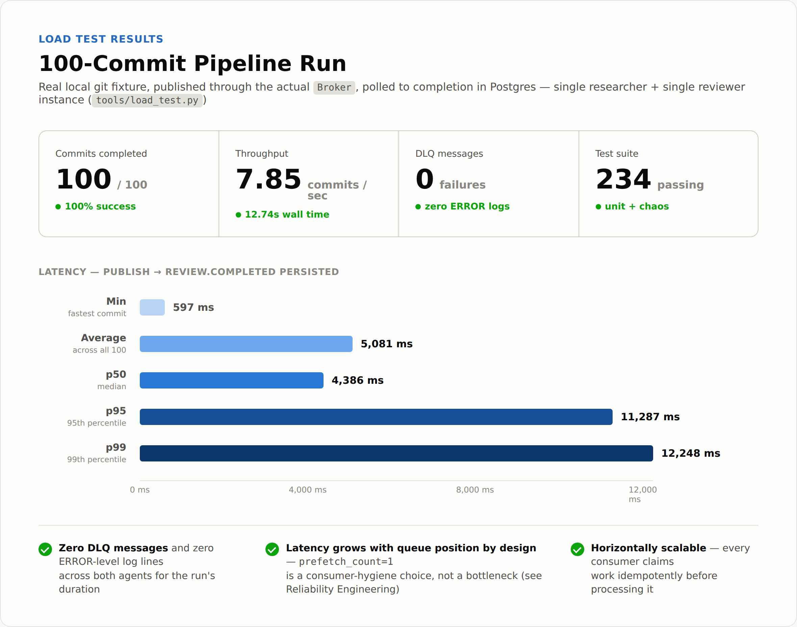
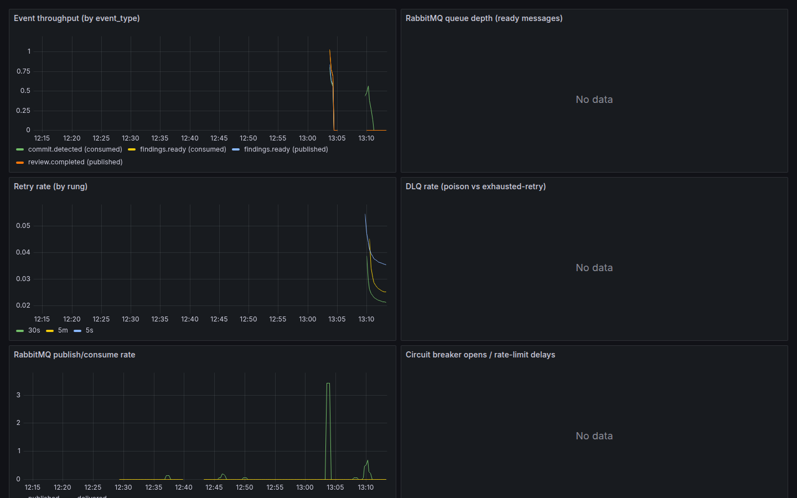

# Code Review Swarm

**A distributed, event-driven multi-agent system that watches GitHub commits,
statically analyzes the affected codebase, computes a deterministic
blast-radius and risk score, has an LLM narrate (never decide) that score,
and reports the result — with a fault-tolerant, fully observable pipeline
underneath every step.**

[](LICENSE)
[](pyproject.toml)
[](tests/)
[](pyproject.toml)

---

## Overview

Most "AI code review" projects are a single LLM call wrapped around a diff.
This one is a case study in the *engineering* that has to exist around that
call before it can survive contact with a real, always-on, at-least-once
production environment.

Push a commit and three cooperating agents — connected only by RabbitMQ
events, never by a direct function call — turn it into a structured risk
report: what changed, how far the blast radius reaches through the
codebase's real import graph, whether it touches anything
security-sensitive, a deterministic risk score, and a plain-English
narrative explaining why. No agent trusts another's uptime — every hop
survives a crash, a redelivery, a transient failure, or an LLM outage
without producing a duplicate or a lost report, and every hop is traced,
metriced, and logged end to end.

The system was built in six incremental phases, each adding one real
architectural layer — message durability, repository analysis, an LLM
layer, fault tolerance, full observability, then production polish —
without touching what the previous phase had already proven. The phase
reports (`PHASE_0_REPORT.md` – `PHASE_6_REPORT.md`) are the build log; this
document is the finished result.

## Architecture



The full topology — including Redis-backed rate limiting and the
OpenTelemetry → Phoenix / Prometheus → Grafana observability stack wired
into every service — is diagrammed below and in
[`docs/architecture.md`](docs/architecture.md):



## How It Works

Each of the three agents does exactly one job and hands off over a durable
queue, never a direct call:

1. **Watcher** (`agents/watcher`) — a FastAPI service that verifies a
   GitHub webhook's `X-Hub-Signature-256` HMAC, filters to watched
   branches, extracts per-commit metadata, and publishes one
   `commit.detected` event per commit.
2. **Researcher** (`agents/researcher`) — clones the repository, walks
   every `*.py` file with the stdlib `ast` module to build a real import
   dependency graph, persists it to Postgres, runs a recursive-CTE
   **blast-radius** query from the changed files outward, flags any
   **sensitive-path** hits, asks a small LLM for a semantic summary
   (empty string on failure — never blocks the pipeline), and publishes
   `findings.ready`.
3. **Reviewer** (`agents/reviewer`) — computes a **deterministic risk
   score** from those findings (pure code, zero model involvement), asks
   an LLM only to *narrate* that already-final score, persists the report
   to Postgres, posts a Slack Block Kit message, and publishes
   `review.completed`.

Every event is a versioned, strictly-typed `Envelope[Payload]`
(`shared/contracts.py`) carrying one `trace_id` that threads through every
log line and OpenTelemetry span from the moment GitHub delivers the
webhook to the moment Slack receives the message — so one commit's entire
journey through the swarm can be grepped or traced by a single ID.

## Example: End-to-End Analysis

The walkthrough below is a real, schema-accurate simulation — generated
locally from this repository's actual contracts and scoring logic, no
network calls or credentials involved — of a commit landing on a
payments-platform repository.

**Repository:** `acme/payment-platform`
**Commit:** `Refactor payment authorization flow`
**Modified files:** `payments/authorization.py`, `payments/gateway.py`,
`auth/session.py`

### 1 — `commit.detected`

The watcher verifies the webhook signature and publishes:

```json
{
  "event_id": "a1c9e2b7-0f6a-45c1-9ec2-a80acf44f814",
  "event_type": "commit.detected",
  "trace_id": "f3d8e120-6b71-4a3f-a3fe-e68eafe880b3",
  "source": "watcher",
  "occurred_at": "2026-09-20T09:14:02Z",
  "payload": {
    "repo": "acme/payment-platform",
    "commit_sha": "7e2c1f9a3d6b58e0c1e9d6b4a7c3f8e1d2a5b6c9",
    "branch": "main",
    "author": "sam@acme.dev",
    "message": "Refactor payment authorization flow",
    "changed_files": [
      "payments/authorization.py",
      "payments/gateway.py",
      "auth/session.py"
    ]
  }
}
```

### 2 — Repository analysis & dependency graph discovery

The researcher clones the commit, walks the checkout with `ast`, and adds
three nodes/edges to the persisted import graph for
`payments.authorization`, `payments.gateway`, and `auth.session` — the
same graph every prior commit to this repo has already built up in
Postgres (`agents/researcher/graph.py`, `agents/researcher/db.py`).

### 3 — Blast-radius calculation

A breadth-first traversal of the graph's reverse edges
(`agents/researcher/impact.py`, backed by a recursive CTE in Postgres)
walks outward from the three changed modules:


| | |
|---|---|
| Impacted modules | 9 (`checkout.flow`, `checkout.cart`, `payments.refunds`, `auth.login`, `billing.invoices`, `order.confirmation`, plus the 3 changed) |
| Max depth reached | 2 |

### 4 — Sensitive-path detection

`agents/researcher/sensitive.py` matches every changed file against the
configured sensitive-path patterns (`auth/`, `payments/`, `infra/`,
`migrations/` by default) — independent of blast-radius size, so a
one-line change to `auth/session.py` can't slip through just because it
touches nothing else:

| Changed file | Pattern matched |
|---|---|
| `payments/authorization.py` | `payments/` |
| `payments/gateway.py` | `payments/` |
| `auth/session.py` | `auth/` |

All three changed files hit the sensitive-path policy — a signal the risk
scorer weights independently of how far the change actually propagates.

### 5 — Semantic summary (locally generated example)

The researcher's summary step (`agents/researcher/summarize.py`) asks a
small/cheap model for a 2–3 sentence summary of the diff. This example
illustrates the shape of that output without calling any provider:

> *"Refactors the payment authorization flow, moving session validation
> ahead of gateway dispatch in `payments/authorization.py` and updating
> `auth/session.py`'s expiry check accordingly. `payments/gateway.py` is
> updated to accept the pre-validated session object rather than
> re-deriving it, removing a redundant lookup on the hot path."*

`findings.ready` is published with this summary, the blast radius, and
the sensitive hits attached.

### 6 — Risk scoring

`agents/reviewer/scoring.py::compute_score` is pure code — five weighted,
bucketed inputs, no model in the loop:

| Input | Value | Points |
|---|---|---|
| Blast radius (max depth = 2) | ≤ 3 | 0 |
| Impacted modules (9) | ≤ 10 | 0 |
| Sensitive-path hits (3 files) | multiple | +4 |
| Changed files (3) | ≤ 5 | 0 |
| Test proximity | no test file in changed set or blast radius | +2 |
| **Total** | | **6 → severity: `high`** |

Three sensitive-path hits and zero test coverage push this commit to
**high** severity — `status_for_severity("high")` maps to
`needs_review` — even though the blast radius itself is modest. This is
the scorer working as designed: blast radius alone would have called this
commit low-risk; the sensitive-path signal is what escalates it.

### 7 — Reviewer narrative

The reviewer asks an LLM to *explain* the already-final score — never to
restate a different one — with a deterministic template as a fallback
whenever no provider is configured:

> *"This commit touches `payments/authorization.py`, `payments/gateway.py`,
> and `auth/session.py` — all three matched by the sensitive-path policy
> for authentication and payments code, which is why the score carries the
> maximum sensitive-hit weight despite a contained blast radius (9 impacted
> modules, max depth 2: `payments.authorization` → `checkout.flow`,
> `payments.gateway` → `checkout.cart` → `order.confirmation`,
> `auth.session` → `auth.login` / `billing.invoices`). No test file was
> touched in this commit, so the session-validation reordering ahead of
> gateway dispatch should be verified manually before merge, with
> particular attention to the payments path receiving a validated session
> before charge submission."*

### 8 — `review.completed`

```json
{
  "event_type": "review.completed",
  "trace_id": "f3d8e120-6b71-4a3f-a3fe-e68eafe880b3",
  "payload": {
    "repo": "acme/payment-platform",
    "commit_sha": "7e2c1f9a3d6b58e0c1e9d6b4a7c3f8e1d2a5b6c9",
    "status": "needs_review",
    "severity": "high",
    "score": 6,
    "score_breakdown": {
      "blast_radius_points": 0,
      "impact_count_points": 0,
      "sensitive_hits_points": 4,
      "changed_files_points": 0,
      "test_proximity_points": 2
    }
  }
}
```

The reviewer persists this report to Postgres, posts a severity-colored
Slack Block Kit message, and publishes `review.completed` — closing the
loop on the same `trace_id` the watcher generated when the webhook first
arrived. A second, real recorded run of this exact pipeline — one
`trace_id` spanning all three services end to end — is in
[`docs/demo/`](docs/demo/).

## Blast Radius Example

The worked example above shows the real payments-platform run; this is
the same capability distilled to its simplest possible case — one file,
one import chain — to make the mechanism itself obvious at a glance.

**Simulated repository:** a single import chain, `database.py` at the
root, three modules depending on it transitively:



| | |
|---|---|
| Changed file | `database.py` |
| Impact count | 4 (`database.py` + 3 transitive dependents) |
| Max depth | 3 |
| Risk | **HIGH** |

A one-line change to `database.py` doesn't just touch that file — it
propagates through `auth.py` and `payments.py` all the way to
`checkout.py`, three hops away. This is exactly what
`agents/researcher/impact.py` computes for every real commit: not "what
did you change," but "what could this change break," traced through the
codebase's actual import graph rather than guessed at.

## Dependency Graph Analysis

`agents/researcher/graph.py` parses every `*.py` file in a checkout with
the stdlib `ast` module — absolute imports, `from` imports, and relative
imports, with best-effort resolution of package-level re-exports — and
persists the result as `modules`/`imports` rows in Postgres, upserted
idempotently per commit so re-analyzing an unchanged commit is a no-op.
This graph is what every blast-radius query walks; it's rebuilt
incrementally as new commits land, so the researcher never re-derives the
whole codebase's dependency shape from scratch on a query.

## Blast Radius Detection

Given a set of changed files, `agents/researcher/impact.py` (in-memory,
unit-testable) and `agents/researcher/db.py` (recursive CTE, the
production path) both walk the graph's *reverse* edges — "who imports
this?" — breadth-first from the changed modules, cycle-safe, bounded by a
configurable max depth (`BLAST_RADIUS_MAX_DEPTH`, default 10). The result
is exactly what fed the risk score above: `impact_count`, `max_depth`, and
the full `impacted_modules` list, all computed with zero AI involvement —
this is graph traversal, not inference, which is why the number is
reproducible and auditable.

## Risk Scoring

`agents/reviewer/scoring.py::compute_score` is deterministic by design:
same `FindingsReady` payload in, same score out, always — no randomness,
no external call, no model in the loop. Five inputs, each bucketed to a
small integer:

| Input | Signal | Buckets → points |
|---|---|---|
| Blast radius | `blast_radius.max_depth` | ≤3→0, ≤10→+2, else→+4 |
| Impacted modules | `blast_radius.impact_count` | ≤10→0, ≤50→+2, else→+4 |
| Sensitive-path hits | `len(sensitive_hits)` | none→0, one→+2, multiple→+4 |
| Changed files | `len(changed_files)` | ≤5→0, ≤20→+1, else→+3 |
| Test proximity | path-marker heuristic | proximate→0, not→+2 |

The sum maps to a severity by configurable thresholds
(`low` / `moderate` / `high` / `critical`), which in turn maps to a CI-gate-style
status (`passed` / `needs_review` / `failed`). The LLM narrative step that
follows is given this score as an immutable fact and explicitly instructed
never to restate a different one — if the model and the scorer ever
disagree, the scorer is correct by construction. The worked example above
shows exactly why this separation matters: a small blast radius alone
would have scored this commit low-risk, but the sensitive-path signal
correctly overrode that and pushed it to `needs_review`.

## Reliability Engineering

RabbitMQ's at-least-once delivery means every one of these had to be
solved for real, not assumed away. Every event is routed through the same
retry ladder, idempotency gate, and dead-letter path regardless of which
agent is consuming it:



Static render, with the idempotency-claim gate each consumer passes
through before doing any work:
[`docs/images/event_flow.png`](docs/images/event_flow.png).

- **TTL + dead-letter-exchange retry ladder** (`shared/retry.py`) — a
  hand-built `q.retry.5s → q.retry.30s → q.retry.5m → q.dlq` pattern,
  since no delayed-retry plugin is assumed. A subtlety verified against a
  live broker before relying on it: a TTL-expired message is redelivered
  with the routing key it entered the rung with, so each rung's own small
  topic exchange is just a named "entry door" — the main exchange's
  bindings route it back to the correct origin queue for free.
- **Three-way error classification** (`shared/errors.py`) —
  `RetryableError` (HTTP 429/5xx, transient network/git failures) enters
  the ladder; `PoisonMessageError` (schema violations, malformed LLM
  responses) skips straight to the DLQ with zero wasted retries;
  `FatalError` logs critical and stops the service rather than grinding
  through the rest of the queue the same broken way.
- **Claim-before-processing idempotency** (`shared/idempotency.py`) — an
  atomic `INSERT ... ON CONFLICT DO NOTHING` claim taken before any work
  starts, so two concurrent redeliveries of the same event can never both
  proceed. A **hard crash mid-message** (SIGKILL, OOM) leaves a claim
  that's neither completed nor released; after `IDEMPOTENCY_STALE_CLAIM_SECONDS`
  it's treated as abandoned and safely reclaimed — never a permanent skip,
  never a duplicate side effect.
- **Redis-backed distributed rate limiting** (`shared/ratelimit.py`) — a
  Lua-script token bucket shared across every instance of an agent, scoped
  per provider/model, refilling continuously rather than resetting at a
  window boundary.
- **Per-provider circuit breaker** (`shared/breaker.py`) — standard
  CLOSED/OPEN/HALF_OPEN state machine in front of every LLM call, failing
  fast with no network attempt once a provider is unhealthy, rather than
  letting it become a new single point of failure.
- **Manual ack, `prefetch=1`, graceful shutdown** — every outcome is an
  explicit, logged routing decision; SIGTERM drains in-flight work within
  a bounded window before exiting.
- **A DLQ inspect/dry-run/replay CLI** (`tools/replay_dlq.py`) — nothing
  is ever silently dropped, and a replay gets a fresh attempt budget once
  the root cause is fixed.
- **Validated with real chaos scenarios**, not just unit tests —
  `tests/test_chaos.py` runs crash-mid-processing, persistent-failure,
  malformed-contract, duplicate-delivery, and circuit-breaker-full-cycle
  scenarios against a live broker and database.



## Performance Results

100-commit load test (`tools/load_test.py`) against a real local git
fixture, published through the actual `Broker`, polled to completion in
Postgres — single researcher + single reviewer instance:



| Metric | Value |
|---|---|
| Commits submitted / completed | 100 / 100 |
| DLQ messages | 0 |
| Throughput | 7.85 commits/sec |
| Average latency | 5081.0 ms |
| p50 latency (publish → report persisted) | 4385.6 ms |
| p95 latency | 11286.7 ms |
| p99 latency | 12248.3 ms |

Zero DLQ messages and zero ERROR-level log lines across both agents for
the run's duration. Latency grows with queue position by design —
`prefetch_count=1` means the researcher processes strictly one commit at a
time, an intentional consumer-hygiene choice (see
[Reliability Engineering](#reliability-engineering)), not a bottleneck —
and both agents are safe to scale horizontally behind the same queue,
since every consumer claims work idempotently before processing it. Full
methodology, environment details, and known bottlenecks in
[`docs/performance.md`](docs/performance.md).

## Observability Highlights

Every service ships tracing, metrics, and structured logs from the same
`shared/telemetry.py` module — none of it bolted on after the fact:

- **OpenTelemetry distributed tracing** across every RabbitMQ hop, with
  W3C `traceparent` propagation injected on publish and continued on
  consume, exported to **Arize Phoenix** — one `trace_id` spans
  `watcher → RabbitMQ → researcher → RabbitMQ → reviewer → Slack` as a
  single trace, verified live against a running Phoenix instance (13
  spans across all three services in one trace).
- **24 custom Prometheus instruments** — throughput, retry/DLQ counts,
  circuit-breaker state transitions, LLM calls/cost/latency, repository
  clone/graph/blast-radius/Postgres timings — plus RabbitMQ's and
  Postgres's own exporters. Every metric name a Grafana panel queries is
  statically cross-checked against the real registered instrument names
  by `tests/test_observability_config.py`.
- **3 auto-provisioned Grafana dashboards** (System Overview, LLM,
  Repository) — no manual import step.
- **Structured JSON logs** carrying both the business `trace_id` and the
  OTel `trace_id`/`span_id`, so a log line and a Phoenix trace are always
  cross-referenceable in either direction.
- **Per-call LLM cost estimation**, recorded as both a span attribute and
  a Prometheus counter.



The full observability evidence set — RabbitMQ's live queue topology and
a real distributed trace waterfall in Phoenix, alongside this dashboard —
is in [`docs/screenshots/`](docs/screenshots/); full diagrams (data flow,
observability stack, persistence layout) are in
[`docs/architecture.md`](docs/architecture.md).

## Technical Achievements

Engineering decisions worth calling out on their own:

- **The LLM never makes a decision it can be wrong about.** Risk scoring
  is pure, deterministic code (`agents/reviewer/scoring.py`); the model is
  given a final score and instructed only to explain it, with a
  template-based fallback so a report is never missing a narrative. This
  is the difference between "AI-assisted" and "AI-decided," and it's
  enforced structurally, not by prompt convention.
- **Provider-agnostic LLM layer with no vendor SDK.** `shared/llm.py`
  defines one `LLMClient` protocol with direct-HTTP implementations for
  Anthropic, OpenAI, and Ollama, all routed through a single resilience
  choke point (`_execute_with_resilience`) that wires in rate limiting,
  circuit breaking, and exponential-backoff-with-full-jitter retry
  identically regardless of provider.
- **A hand-built RabbitMQ delayed-retry ladder**, because the standard
  broker has no native "retry in N seconds" primitive without a
  non-default plugin — implemented as a TTL + dead-letter-exchange
  pattern, with a routing-key-preservation subtlety verified empirically
  against a live broker before the rest of the system was built on top of
  it.
- **A crash-safe idempotency model** that distinguishes "claimed and
  completed" from "claimed, then the process died mid-work" — the
  distinction that makes a hard SIGKILL mid-message safely reclaimable
  instead of either a silent permanent skip or a duplicate Slack message.
- **One trace_id, three services, zero blind spots.** Every RabbitMQ hop
  continues the same OpenTelemetry trace via W3C header propagation rather
  than starting a new one, so a single distributed trace covers the
  webhook, both queue hops, and the Slack delivery.
- **Contracts as the only coupling between agents.** Three services never
  call each other directly — `shared/contracts.py`'s versioned, strict
  Pydantic models are the entire interface, evolved additively so an older
  consumer never breaks on a newer producer's payload.

## Repository Map

```
agents/watcher/      GitHub webhook -> commit.detected (FastAPI)
agents/researcher/   commit.detected -> dependency graph, blast radius, sensitive-path check -> findings.ready
agents/reviewer/     findings.ready -> deterministic risk score, LLM narrative, Postgres, Slack -> review.completed
shared/              contracts, broker, retry ladder, idempotency, rate limiting, circuit breaker, telemetry, LLM client
docs/architecture.md Full diagram set: data flow, retry/DLQ flow, observability stack, persistence layout
docs/performance.md  Load-test methodology, results, known bottlenecks
docs/demo/           One real, schema-validated event chain, start to finish
docs/runbooks/       Deploy, operations, and recovery procedures
PHASE_0..6_REPORT.md The six-phase build log this system was developed against
```

## Development History

Built in six phases, each adding one architectural layer without
redesigning what came before — full detail in each phase's report:

| Phase | What it added |
|---|---|
| [0](PHASE_0_REPORT.md) | Message broker topology, database schema, shared contracts, structured logging |
| [1](PHASE_1_REPORT.md) | Walking skeleton — webhook → RabbitMQ → consumer, durable and acknowledged |
| [2](PHASE_2_REPORT.md) | AST dependency graph, recursive-CTE blast radius, sensitive-path detection |
| [3](PHASE_3_REPORT.md) | Provider-agnostic LLM layer, semantic summaries, deterministic risk scoring, Slack |
| [4](PHASE_4_REPORT.md) | Retry ladder, error classification, idempotency, rate limiting, circuit breaker |
| [5](PHASE_5_REPORT.md) | End-to-end distributed tracing, Prometheus metrics catalog, Grafana dashboards |
| [6](PHASE_6_REPORT.md) | Containerization, CI, runbooks, and this showcase pass |

---

For running the stack yourself, see
[`docs/runbooks/deploy.md`](docs/runbooks/deploy.md) (setup and GitHub
webhook configuration), [`docs/runbooks/operations.md`](docs/runbooks/operations.md)
(generating events, watching the pipeline), and
[`docs/runbooks/recovery.md`](docs/runbooks/recovery.md) (DLQ replay,
failure investigation). Contribution guidelines in
[`CONTRIBUTING.md`](CONTRIBUTING.md), security policy in
[`SECURITY.md`](SECURITY.md), and what's next in [`ROADMAP.md`](ROADMAP.md).
