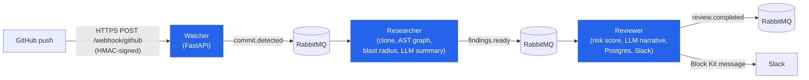
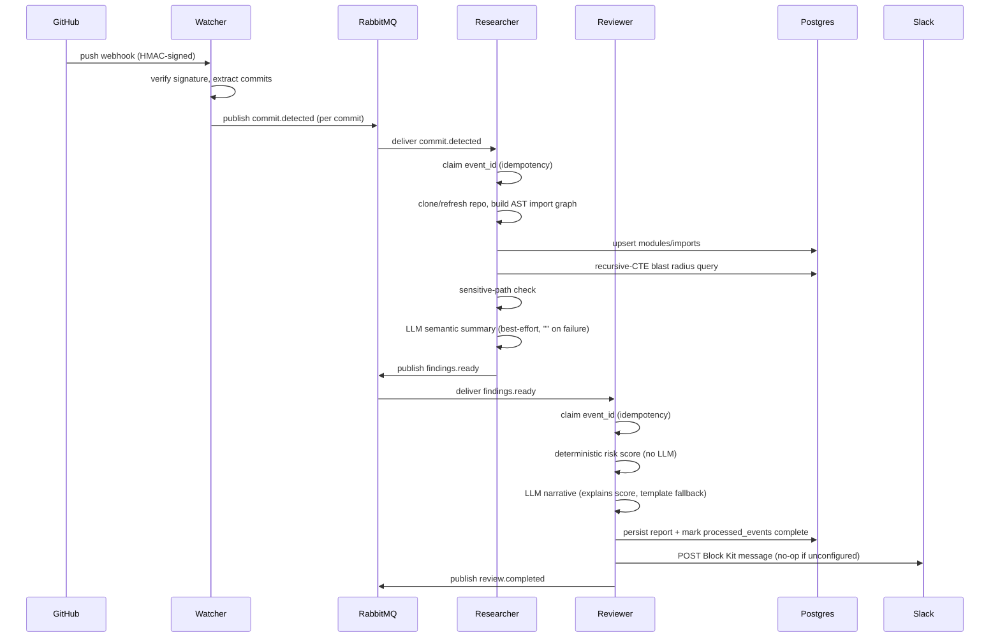
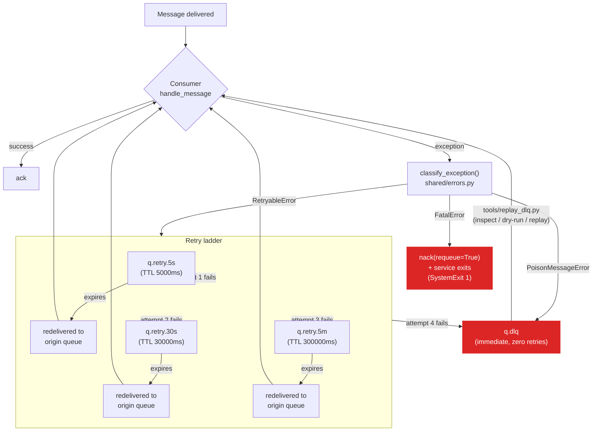
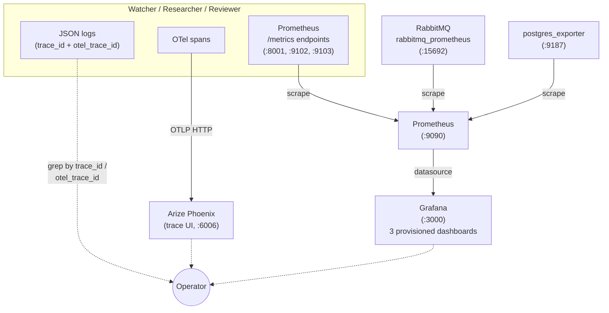
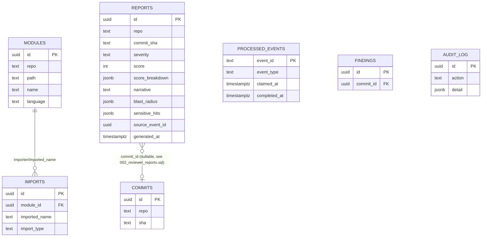

# Architecture

This document is the single diagram-first reference for how the swarm
fits together. For the prose version of any of this — why a decision was
made, what was tried, what broke — the six `PHASE_*_REPORT.md` files at
the repo root are the primary source; this page summarizes and diagrams
what they describe.

## System overview

Every hop is an `Envelope[Payload]` (see [`shared/contracts.py`](../shared/contracts.py))
carrying a `trace_id` generated once per webhook delivery and threaded
through every log line and OTel span — see [Data flow](#data-flow) below
for what actually rides in that envelope at each stage, and
[`docs/demo/`](demo/) for real, schema-validated example payloads.

## Data flow

Each stage adds fields to what it knows; nothing already on the wire is
ever removed (see `shared/contracts.py`'s "additive only" evolution
described in `PHASE_2_REPORT.md`/`PHASE_3_REPORT.md`).

See [`docs/demo/`](demo/) for one real, internally-consistent set of
payloads for every arrow above (`sample_commit.json` ->
`sample_findings.json` -> `sample_review.json` ->
`sample_slack_message.json`), sharing one `trace_id` and a real
correlation-id chain.

## Failure recovery: retry and DLQ flow

RabbitMQ has no native delayed-retry primitive, so this is a hand-built
TTL + dead-letter-exchange "parking lot" ladder — see
`shared/retry.py` and `PHASE_4_REPORT.md`'s "Retry-ladder flow" for the
routing-key-preservation subtlety this depends on.

Idempotency (`shared/idempotency.py`) sits underneath every path here: a
claim is taken before any work starts and released on a retryable
failure, so a redelivery from any rung of the ladder — or a crash with no
release at all — can never produce a duplicate report or Slack message.
See `PHASE_4_REPORT.md`'s "Idempotency design" and "Chaos test evidence"
(scenarios A/B/E) for the exact crash/duplicate scenarios this was
validated against.

## Observability stack

Every metric name a dashboard panel queries is statically cross-checked
against `shared/telemetry.py`'s real registered Prometheus instrument
names by `tests/test_observability_config.py` — see `PHASE_5_REPORT.md`
for the catalog and the one real bug this caught (`_ms` vs
`_milliseconds` suffix mismatch) before it ever reached a running
Prometheus.

## Persistence layer

- **`modules`/`imports`** — the researcher's persisted AST dependency
  graph (`agents/researcher/db.py`), one row per file / per import edge,
  upserted idempotently per commit. The recursive-CTE blast-radius query
  (`PHASE_2_REPORT.md`) runs directly over these two tables.
- **`reports`** — the reviewer's output (`db/migrations/002_reviewer_reports.sql`),
  keyed by `(repo, commit_sha)` rather than a hard FK to `commits` (nothing
  populates `commits` yet — see that migration's own header comment for
  why, and `PHASE_3_REPORT.md`'s "Known limitations").
- **`processed_events`** — the idempotency ledger (`shared/idempotency.py`),
  extended in `db/migrations/003_idempotency_claims.sql` with
  `claimed_at`/`completed_at` so a claim and its completion are
  distinguishable — this is what makes a hard crash mid-message safely
  reclaimable instead of a silent permanent skip.
- **`commits`/`findings`/`audit_log`** — declared in
  `db/migrations/001_init_schema.sql` for a future phase; not written to
  by any agent today (see `PHASE_3_REPORT.md`'s known limitations).

Redis holds no durable state relevant to this diagram — it's the
rate-limiter's token-bucket counters (`shared/ratelimit.py`), ephemeral by
design.
