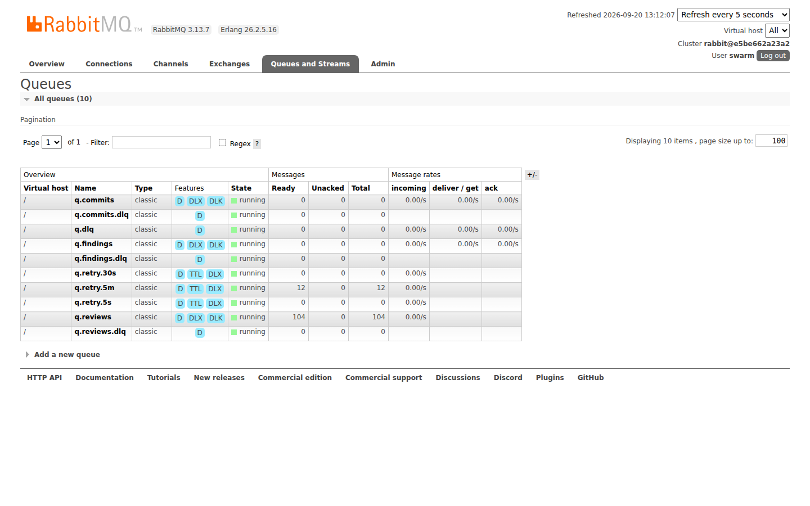
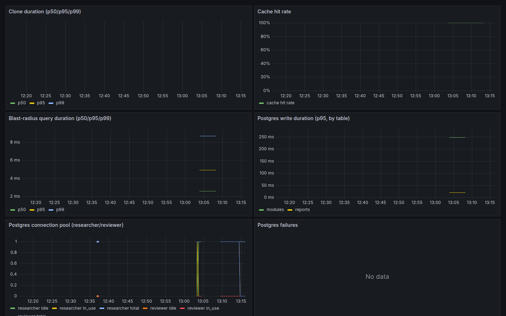
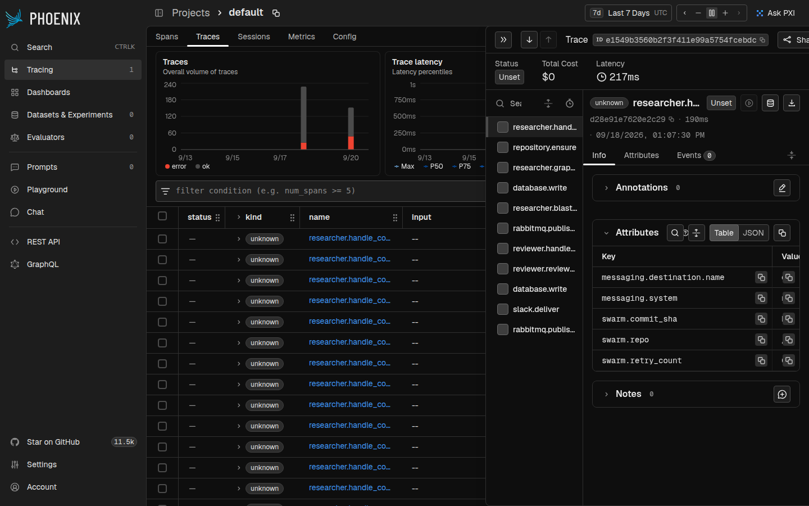

# Performance

## 100-commit load test

Run with `tools/load_test.py` (added in Phase 5) — creates a real local
git fixture repo (a small import graph, so blast radius does real
recursive-CTE work), publishes 100 real `commit.detected` events through
the actual `Broker`, then polls Postgres until every commit's
`review.completed` report is persisted.

```bash
python -m agents.researcher.main &
python -m agents.reviewer.main &
python -m tools.load_test --count 100 --timeout 180
```

**Result (this session, regenerated for Phase 6 — reproducible, not
copied from an earlier phase report):**

```
Commits submitted: 100
Commits completed (review.completed persisted): 100/100
Wall time (first publish -> last completion): 12.74s
Throughput: 7.85 commits/sec

Latency (publish -> review.completed persisted)
  Average: 5081.0 ms
  p50:     4385.6 ms
  p95:    11286.7 ms
  p99:    12248.3 ms
  Min:      596.8 ms
  Max:    12252.0 ms
```

100/100 completed, **zero** DLQ messages, **zero** ERROR-level log lines
across both agents for the run's duration (the 100 WARNING lines per
agent are the expected `"semantic summary generation skipped"` /
`"narrative generation skipped, using fallback"` messages, since
`LLM_PROVIDER=none` in this environment — not failures). Cross-checked
against Prometheus after the run:

```
swarm_events_processed_total{event_type="commit.detected",direction="consumed",job="researcher"}  100
swarm_events_processed_total{event_type="findings.ready", direction="published",job="researcher"}  100
swarm_events_processed_total{event_type="findings.ready", direction="consumed",job="reviewer"}      100
swarm_events_processed_total{event_type="review.completed",direction="published",job="reviewer"}    100

histogram_quantile(0.95, sum(rate(swarm_review_duration_milliseconds_bucket[5m])) by (le))
  -> 23.8 ms   # reviewer-side processing only (LLM disabled), matches Phase 5's 24.95ms
```

This is statistically consistent with `PHASE_5_REPORT.md`'s original run
(100/100, 7.57 commits/sec, p50 3.83s/p95 11.71s/p99 12.70s) — the swarm's
throughput/latency profile hasn't regressed across Phases 5 and 6, which
only added containerization, CI, and documentation, not pipeline logic.

## Environment details

| | |
|---|---|
| CPU | AMD EPYC 7763, 2 vCPUs available to this container |
| Memory | 7.8 GiB total |
| Python | 3.14.2 |
| Docker | 29.7.2 |
| Topology | 1 watcher (idle during this test — commits injected directly via `tools/load_test.py`, bypassing the webhook), 1 researcher, 1 reviewer, each a single host process |
| `RABBITMQ_PREFETCH` / consumer `prefetch_count` | 1 (deliberate — see "Consumer hygiene" below) |
| LLM provider | `none` (`NullLLMClient` — no live provider reachable in this environment, same as every prior phase's validation; see [Known bottlenecks](#known-bottlenecks)) |
| RabbitMQ / Postgres / Redis | official images (`rabbitmq:3.13-management`, `postgres:16`, `redis:7-alpine`), containerized; agents as host processes (`docker-compose.yml` topology) |

## Throughput and latency interpretation

Latency grows with queue position (min 597ms for an early commit, max
12.25s for one of the last of 100) because the researcher processes
strictly **one commit at a time** (`prefetch_count=1`, manual ack) — an
intentional Phase 4 design choice (see the README's "Consumer hygiene and
graceful shutdown"), not a bottleneck introduced here. p50/p95/p99 above
characterize *this specific single-instance queueing behavior* under a
100-commit burst, not a theoretical ceiling — see
[Scaling](#scaling-recommendations) below.

## Known bottlenecks

- **Single-instance serial processing.** One researcher + one reviewer
  process, each handling exactly one message at a time. This is the
  dominant factor in the tail latency above — the 100th commit waits for
  the 99 ahead of it. Confirmed safe to scale horizontally (see below).
- **No live LLM provider validated under load.** Every number above
  reflects `LLM_PROVIDER=none` (the `NullLLMClient` fast-fail path — no
  network call at all). A real provider adds real network latency
  (typically hundreds of ms to a few seconds per call) to both the
  researcher's semantic-summary step and the reviewer's narrative
  generation, and would be rate-limited/circuit-broken under sustained
  load — see `shared/ratelimit.py`/`shared/breaker.py`. This has never
  been load-tested against a live provider in any phase of this project
  (see `PHASE_5_REPORT.md`'s "Recommendations for Phase 6").
- **Blast-radius query cost scales with fan-out, not just depth.** The
  recursive CTE (`agents/researcher/db.py::blast_radius`) bounds
  traversal *depth*, not the number of rows visited per level — a very
  high fan-out node in a large real-world monorepo's import graph could
  produce a larger intermediate result before the final `GROUP BY`
  dedups it. Not observed as a problem at the fixture-repo scale this
  test (or any prior phase's validation) exercises.
- **Full AST re-walk per commit.** `agents/researcher/graph.py` re-parses
  every `*.py` file in the checkout on every commit rather than only the
  changed files — fine at the repo sizes tested, would need per-file
  hashing/caching to scale to a very large monorepo (flagged since
  `PHASE_2_REPORT.md`).

## Scaling recommendations

Both `researcher` and `reviewer` are safe to run as multiple replicas —
each claims work via `shared/idempotency.py` before processing, so two
replicas competing for the same queue never double-process a message:

```bash
docker compose -f docker-compose.prod.yml up -d --scale researcher=3 --scale reviewer=3
```

`watcher` should stay at one replica unless a load balancer is placed in
front of it (a stateless FastAPI app, so that's a routing decision, not a
code change). RabbitMQ/Postgres/Redis remain single instances in both
compose files — scaling those is a real-deployment (not local-dev)
concern tracked in `ROADMAP.md`.

## Observability screenshots

Captured live in this session (headless Chrome, not mockups) — see
[`docs/screenshots/`](screenshots/) for the full set and what each one
shows:






Open http://localhost:3000 (Grafana, `admin`/`admin`) and
http://localhost:6006 (Phoenix) against your own running stack to
explore interactively; `docs/architecture.md`'s "Observability stack"
diagram shows how the pieces connect.
